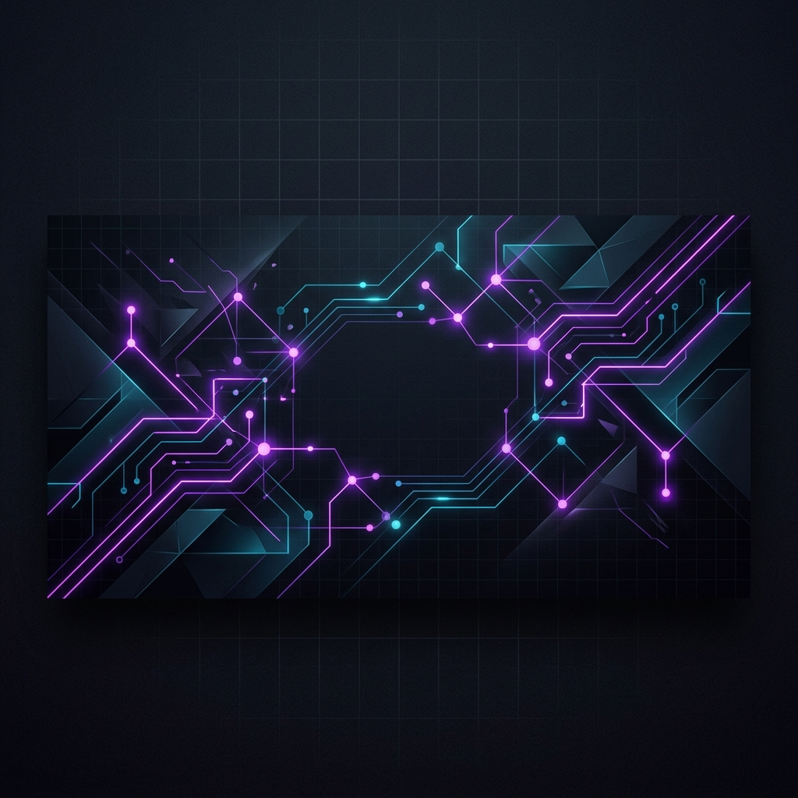

  

 

<h1 align="center">
  
</h1>

  
  
  

---

### 💫 About Me

I am a passionate **Full-Stack Web Developer** based in Indonesia, specializing in building modern, performant, and visually stunning web applications. With over **3 years of hands-on experience**, I focus on bridging the gap between pixel-perfect, interactive UI/UX designs and high-performance system logic.

- 🎓 Studying **Media Kreatif** (Web Technology) at **Polimedia Jakarta**.
- 🚀 **Fast Learner** who loves adapting to new technologies, frameworks, and architecture patterns.
- 🎨 **UI/UX Focused**, bringing a strong eye for detail, smooth transitions, and glassmorphism design.
- ⚙️ Skilled in writing clean, scalable REST APIs, microservices, and database models.
- 🤖 Tinkering with automation scripts, local workflows, and AI assistants to boost coding productivity.

---

### 🛠️ Tech Stack & Skills

  <strong>🌐 Frontend:</strong>
   
  
  
  
  
  

  <strong>⚙️ Backend:</strong>
   
  
  
  

  <strong>🗄️ Databases:</strong>
   
  
  
  

  <strong>🔧 DevOps & Tools:</strong>
   
  
  
  
  
  

---

### 💻 Featured Projects

Here are some of the web applications I have built and deployed:

  
<b>🛠️ Linear Task Board</b> (Kanban Board Issue Tracker)

  

    A high-performance Kanban board inspired by Linear's issue tracker. Features sub-second drag-and-drop column management, hotkeys, and nested filters.
     
    <i>Stack: React, TypeScript, Redux, Tailwind CSS, Dnd-Kit</i>
     
    👉 <a href="https://github.com/sandroporto/linear-task-board" target="_blank">GitHub Repository</a> | <a href="https://linear-clone.sandroporto.dev" target="_blank">Live Demo</a>
  

  
<b>🚀 Raycast Launcher Suite</b> (Web Command Palette)

  

    A standalone command bar component inspired by Raycast and Spotlight. Features lightweight fuzzy search, custom action bindings, and a beautiful glassmorphism design.
     
    <i>Stack: React, TypeScript, Tailwind CSS, Framer Motion</i>
     
    👉 <a href="https://github.com/sandroporto/raycast-palette" target="_blank">GitHub Repository</a> | <a href="https://raycast.sandroporto.dev" target="_blank">Live Demo</a>
  

  
<b>🔗 Notion Sync Hub</b> (Integration Manager Dashboard)

  

    A visual dashboard that maps databases and coordinates dual database synchronization between Notion, PostgreSQL, and Hubspot.
     
    <i>Stack: React, TypeScript, Node.js, PostgreSQL, Notion API</i>
     
    👉 <a href="https://github.com/sandroporto/notion-sync-hub" target="_blank">GitHub Repository</a> | <a href="https://notion-sync.sandroporto.dev" target="_blank">Live Demo</a>
  

  
<b>🎨 Framer Portfolio Builder</b> (No-Code Workspace Generator)

  

    An in-browser design editor that models Framer's workspace, enabling users to build responsive landing pages via drag-and-drop.
     
    <i>Stack: React, TypeScript, Tailwind CSS, Framer Motion, Vite</i>
     
    👉 <a href="https://github.com/sandroporto/framer-builder" target="_blank">GitHub Repository</a> | <a href="https://framer-builder.sandroporto.dev" target="_blank">Live Demo</a>
  

---

### 📊 GitHub Stats

  
  

  

---

  <i>"Simplicity is the soul of efficiency."</i> — Austin Freeman
   
  ⭐ Feel free to star my repositories if you find them helpful!

